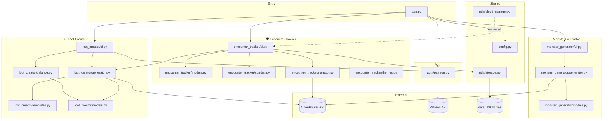
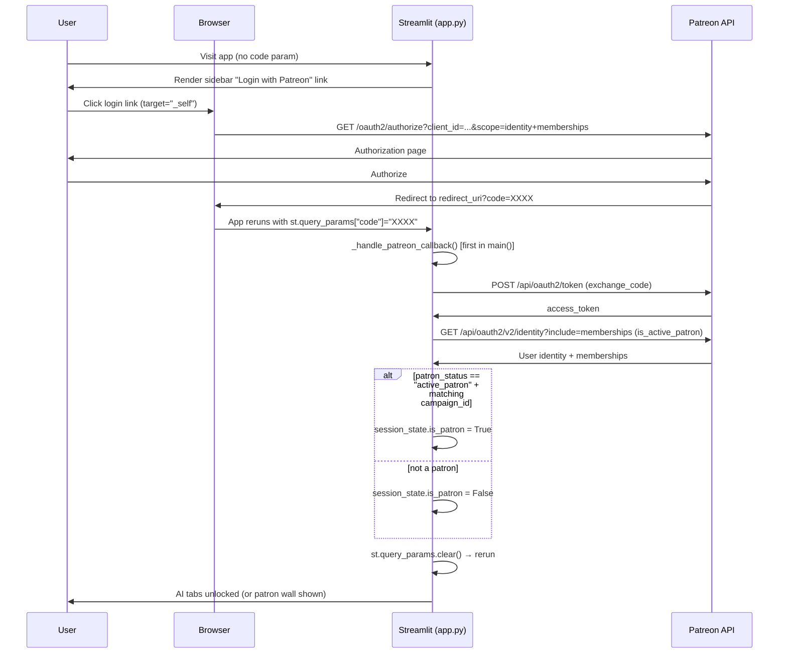

# Codebase Map

> Auto-generated by Cartographer. Last mapped: 2026-03-05

## System Overview



---

## Directory Structure

```
CreateLootItemAndEncounterOrderDND/
├── app.py                        # Entry point — page config, Patreon OAuth, tab routing
├── config.py                     # Constants: OpenRouter credentials, file paths, D&D data lists
├── requirements.txt              # streamlit, openai, pydantic, python-dotenv, requests
│
├── auth/
│   ├── __init__.py               # Empty
│   └── patreon.py                # Patreon OAuth 2.0: build_auth_url, exchange_code, is_active_patron
│
├── loot_creator/
│   ├── __init__.py               # Re-exports all public names
│   ├── models.py                 # Enums + Pydantic models: LootParameters, QuickLootParameters, MagicItem
│   ├── templates.py              # Prompt builders: build_item_prompt, build_quick_item_prompt
│   ├── generator.py              # OpenRouter call + JSON extraction → MagicItem
│   ├── balance.py                # Power score formula [(ΔDPR×A×U)+D+C]×R−(Kₐ+Kₙ)
│   └── ui.py                     # Quick/Advanced modes, parchment card, saved items
│
├── encounter_tracker/
│   ├── __init__.py               # Re-exports Creature, Encounter, roll_initiative, sort_by_initiative
│   ├── models.py                 # Creature (HP, conditions, action counters, death saves), Encounter (log, turns)
│   ├── combat.py                 # Pure utils: roll_d20, roll_initiative, sort_by_initiative, apply_damage/healing
│   ├── themes.py                 # BASE_CSS for .creature-card-bloodied / .creature-card-active (defined, not applied)
│   ├── narrator.py               # AI combat story generator: generate_combat_narrative(log, key, context)
│   └── ui.py                     # Full UI: creature cards, HP bar, counters, death saves, log, narrator, loot
│
├── monster_generator/
│   ├── __init__.py               # Empty
│   ├── models.py                 # GeneratorParams, MonsterStatBlock, DungeonRoom, GeneratorOutput
│   ├── generator.py              # OpenRouter call → GeneratorOutput (monster + room in one call)
│   └── ui.py                     # CR slider, theme input, parchment two-column stat block card
│
├── utils/
│   ├── __init__.py               # Re-exports load_json, save_json
│   ├── storage.py                # load_json / save_json with safe defaults; ensure_data_dir()
│   └── cloud_storage.py          # StorageBackend ABC, LocalBackend, NullCloudBackend [built, not wired]
│
├── data/
│   ├── saved_items.json          # Persisted MagicItem dicts
│   ├── saved_encounters.json     # Persisted Encounter dicts
│   └── srd_monsters.json         # Static SRD creature list for encounter tracker dropdown
│
├── docs/
│   └── CODEBASE_MAP.md           # This file
│
├── .streamlit/
│   └── secrets.toml              # LOCAL ONLY — gitignored. OpenRouter key + Patreon OAuth keys.
│
├── .gitignore                    # Excludes secrets.toml, .env, __pycache__, .venv, data/ (commented out)
├── CLAUDE.md                     # Project instructions for Claude Code
├── example.css / example.html    # Reference parchment card design (Cinzel + EB Garamond)
└── todo.txt                      # Original feature roadmap (now fully implemented)
```

---

## Module Guide

### `app.py` — Entry Point & Auth Orchestrator

**Purpose:** Page config, Patreon OAuth lifecycle, `ai_features_enabled` flag, tab routing.

**Key files:** `app.py` (1,399 tokens)

**Exports:** `main()`

**Critical flow:**
1. `_handle_patreon_callback()` — **must run first** in `main()`. Reads `st.query_params["code"]`, exchanges for token, sets `st.session_state.is_patron`, clears params.
2. `_get_patreon_config()` — returns `None` when any of the 4 Patreon secrets is missing/empty → **dev mode, all features open**.
3. `ai_enabled = (cfg is None) or st.session_state.get("is_patron", False)` → stored in `st.session_state.ai_features_enabled`.
4. Encounter Tracker tab **always renders**; Loot Creator and Monster Generator tabs show `_render_patron_wall()` when not enabled.

**Dependencies:** `config`, `auth.patreon` (lazy), all three `render_*` functions.

---

### `auth/patreon.py` — Patreon OAuth Helpers

**Purpose:** Pure HTTP functions, no Streamlit. Called lazily from `app.py` only when Patreon is configured.

| Function | Description |
|---|---|
| `build_auth_url(client_id, redirect_uri)` | Builds `https://www.patreon.com/oauth2/authorize?...` with scope `identity memberships` |
| `exchange_code(code, client_id, client_secret, redirect_uri)` | POSTs to token endpoint → returns `access_token` string |
| `is_active_patron(access_token, campaign_id)` | GETs `/identity?include=memberships`, checks `patron_status=="active_patron"` + matching campaign ID |

**Dependencies:** `requests`, `urllib.parse`

**Gotchas:**
- `is_active_patron` returns `False` silently if the Patreon API response shape changes (no schema validation).
- Access tokens are not refreshed — users must re-login when tokens expire.

---

### `config.py` — Constants

**Purpose:** Single source of truth for credentials, paths, and D&D data.

| Constant | Value |
|---|---|
| `OPENROUTER_BASE_URL` | `"https://openrouter.ai/api/v1"` |
| `OPENROUTER_DEFAULT_MODEL` | `"deepseek/deepseek-v3.2"` |
| `OPENROUTER_API_KEY` | From `.env` via `load_dotenv()` |
| `SAVED_ITEMS_FILE` | `"data/saved_items.json"` |
| `SAVED_ENCOUNTERS_FILE` | `"data/saved_encounters.json"` |
| `SRD_MONSTERS_FILE` | `"data/srd_monsters.json"` |

**Gotchas:** All file paths are relative to the working directory — must run `streamlit run app.py` from the project root.

---

### `loot_creator/` — AI Magic Item Generation

**Purpose:** Full pipeline from UI parameters → Gemini-style prompt → OpenRouter → `MagicItem` output with parchment card display.

**Key files:**
| File | Purpose | Tokens |
|---|---|---|
| `models.py` | All enums and Pydantic models | 1,688 |
| `templates.py` | Prompt builders | 1,949 |
| `generator.py` | OpenRouter integration | 1,252 |
| `balance.py` | Power score formula | 2,483 |
| `ui.py` | Streamlit UI | 5,189 |

**Two modes:**
- **Quick Mode:** `QuickLootParameters(rarity, theme_description)` → `build_quick_item_prompt` → AI → `MagicItem`
- **Advanced Mode:** `LootParameters` (7 parameter sections A–G) → `build_item_prompt` → AI → `MagicItem` + live power score preview

**`MagicItem` output fields:** name, item_type, subtype, rarity, requires_attunement, description, properties, active_effects, curse_description, lore, power_score, `gold_value`, `crafting_materials`, `suggested_cr`

**Gotchas:**
- `balance.py` has two independent implementations of the formula (`calculate_power_score` and `get_power_score_details`); changes must be applied to both.
- `_esc()` must replace `\n\n` → `<br><br>` **after** HTML-escaping to prevent CommonMark blank-line block termination in `st.markdown(unsafe_allow_html=True)`.

---

### `encounter_tracker/` — Combat Manager

**Purpose:** Full D&D 5e combat tracker: initiative order, HP/conditions, action counters, death saves, combat log, AI narrator, post-combat loot.

**Key files:**
| File | Purpose | Tokens |
|---|---|---|
| `models.py` | Creature + Encounter state + logic | 1,143 |
| `combat.py` | Pure dice/sort/damage utilities | 448 |
| `themes.py` | BASE_CSS (currently unused by UI) | 126 |
| `narrator.py` | AI combat story generator | 403 |
| `ui.py` | Full Streamlit UI | 5,046 |

**`Creature` model key fields:**
- HP: `max_hp`, `current_hp`; properties `hp_percentage`, `is_bloodied` (≤50%), `is_unconscious` (=0)
- Action counters: `actions_total/used`, `bonus_actions_total/used`, `reactions_total/used`, `legendary_actions_total/used`
- Death saves: `death_save_successes`, `death_save_failures`; properties `is_stable` (≥3 successes), `is_dead` (≥3 failures)

**`Encounter` model key fields:**
- `creatures: list[Creature]`, `current_turn_index`, `round_number`, `is_active`
- `combat_log: list[str]` — entries prefixed `"Round N: ..."`
- Methods: `next_turn()`, `prev_turn()`, `log()`, `reset_combat()`, `remove_creature()`

**AI sections (Patreon-gated):**
- `render_narrator_section()` — checks `ai_features_enabled` before showing; passes `combat_log + DM context` to `generate_combat_narrative()`
- `render_post_combat_loot()` — lazy-imports `loot_creator.generator.generate_quick_item`; cross-module dependency

**Gotchas:**
- HP mutations in `render_health_bar()` are done inline (not via `combat.py`'s `apply_damage`).
- `themes.py` CSS classes `.creature-card-bloodied`/`.creature-card-active` are **defined but never applied**.
- `cloud_storage.py` is not used; save/load calls `load_json`/`save_json` directly.
- `prev_turn()` does not restore action counters.

---

### `monster_generator/` — AI Monster & Dungeon Generator

**Purpose:** Single-call AI generation of a full D&D 5e monster stat block + dungeon room. Parchment two-column card display.

**Key files:**
| File | Purpose | Tokens |
|---|---|---|
| `models.py` | GeneratorParams, MonsterStatBlock, DungeonRoom, GeneratorOutput | 430 |
| `generator.py` | Prompt build + OpenRouter call + JSON extraction | 1,391 |
| `ui.py` | CR slider, theme input, stat block card render | 2,601 |

**Data flow:** `GeneratorParams(cr, theme)` → `build_monster_prompt()` → OpenRouter (single combined call) → `_extract_json()` → `GeneratorOutput(monster, room)` → `render_stat_block()` (two-column HTML card).

**Gotchas:**
- `MonsterStatBlock.cr` is `str` (display) while `GeneratorParams.cr` is `float` (computation).
- `ability_scores: dict[str, int]` — UI assumes keys are `"STR"/"DEX"/…`; AI could return full names.
- Prompt docstring still says "Gemini prompt" — stale comment, logic is correct.
- `_extract_json` is a copy of `loot_creator/generator.py`'s extraction — not shared.

---

### `utils/` — Storage Utilities

**Purpose:** JSON persistence and storage abstraction.

| File | Key API |
|---|---|
| `storage.py` | `load_json(path, default=[])`, `save_json(path, data)`, `ensure_data_dir()` |
| `cloud_storage.py` | `StorageBackend` ABC, `LocalBackend`, `NullCloudBackend`, `get_storage_backend()` |

**Gotchas:**
- `cloud_storage.py` is **built but not wired** into any UI — scaffolding for future Supabase/cloud backend.
- `load_json` silently swallows `json.JSONDecodeError` — corrupted JSON returns the default value.
- All paths relative to CWD.

---

## Data Flow — Patreon OAuth



---

## Conventions

- **Streamlit state:** All mutable app state lives in `st.session_state`. Model objects (e.g., `Encounter`) are stored directly and mutated in-place; Streamlit reruns preserve the mutation.
- **Parchment card HTML:** Built via flat string concatenation (no indented f-string templates). CSS injected in a **separate** `st.markdown()` call before the HTML to prevent CommonMark type-6 HTML-block termination on blank lines from AI-generated text.
- **`_esc()` pattern:** HTML-escape first (`&`, `<`, `>`, `"`), then convert `\n\n` → `<br><br>` and `\n` → `<br>`. Order is critical.
- **OpenRouter calls:** All three AI features (loot, narrator, monster) use the same model (`deepseek/deepseek-v3.2`) via the OpenAI SDK with `base_url=OPENROUTER_BASE_URL`. New client created per call.
- **Lazy imports inside buttons:** Heavy imports (narrator, loot generator cross-import) happen inside button click handlers, not at module top-level.
- **Dev mode:** All Patreon secrets empty → `_get_patreon_config()` returns `None` → `ai_features_enabled = True` unconditionally.

---

## Gotchas

1. **`_handle_patreon_callback()` must be first** in `main()` — if any `st.` call runs before it, the query params may be consumed or a rerun triggered before the code is processed.
2. **`patreon_processed` flag** prevents an infinite rerun loop: `st.query_params.clear()` triggers a rerun; the flag ensures the callback is only processed once per session.
3. **CommonMark HTML blocks** — `st.markdown(html, unsafe_allow_html=True)` parses with CommonMark. A `<div>` starts a type-6 HTML block that terminates on the **first blank line**. AI-generated text with `\n\n` must be converted to `<br><br>` via `_esc()` before injection.
4. **Three independent copies of `_esc()`** — in `loot_creator/ui.py`, `monster_generator/ui.py`, and potentially elsewhere. Not in `utils/`.
5. **Two independent `_extract_json` implementations** — `loot_creator/generator.py` and `monster_generator/generator.py`.
6. **`encounter_tracker/themes.py` CSS is dead** — classes defined, never applied in the UI.
7. **`cloud_storage.py` is dead code** — abstraction built, not wired.
8. **Relative paths** — `data/`, `config.DATA_DIR`, `ensure_data_dir()` all resolve relative to CWD. Must run from project root.
9. **No API timeout or retry** — AI calls can hang indefinitely; no `timeout=` on the OpenAI client calls.
10. **Access tokens not refreshed** — Patreon tokens expire; users must re-login. No refresh token handling.

---

## Navigation Guide

**To add a new AI feature:**
1. Add new generator function in the relevant `generator.py` (or new `feature/generator.py`)
2. Add prompt builder to `templates.py` or inline
3. Add UI rendering to the relevant `ui.py`, gating with `st.session_state.get("ai_features_enabled", True)`

**To add a new D&D condition or damage type:**
- `config.py` → `D5E_CONDITIONS` / `DAMAGE_TYPES`

**To change the AI model:**
- `config.py` → `OPENROUTER_DEFAULT_MODEL`

**To wire up cloud storage:**
1. Implement a concrete `StorageBackend` subclass in `utils/cloud_storage.py`
2. Update `get_storage_backend()` to select it
3. Replace `load_json`/`save_json` calls in `encounter_tracker/ui.py` and `loot_creator/ui.py` with `get_storage_backend()` method calls

**To enable Patreon gating locally:**
- Fill in `PATREON_CLIENT_ID`, `PATREON_CLIENT_SECRET`, `PATREON_CAMPAIGN_ID`, `PATREON_REDIRECT_URI` in `.streamlit/secrets.toml`
- Register the app at [patreon.com/portal/registration/register-clients](https://www.patreon.com/portal/registration/register-clients) with redirect URI matching `PATREON_REDIRECT_URI`

**To add a new creature field to the Encounter Tracker:**
1. `encounter_tracker/models.py` → `Creature` — add Pydantic field
2. `encounter_tracker/ui.py` → `render_add_creature_form()` — add input widget
3. `encounter_tracker/ui.py` → `render_creature_card()` — add display logic

**To modify the parchment card design:**
- `loot_creator/ui.py` → `_CARD_CSS` (item card)
- `monster_generator/ui.py` → `_MONSTER_CSS` (stat block card)
- Reference: `example.css` / `example.html` (Cinzel + EB Garamond parchment style guide)

**To deploy to Streamlit Community Cloud:**
1. Push code to GitHub (`.streamlit/secrets.toml` is gitignored — never committed)
2. In Community Cloud → App Settings → Secrets, paste all keys from `secrets.toml`
3. Set `PATREON_REDIRECT_URI` to the actual deployed app URL

---

*If cartographer helped you, consider starring: https://github.com/kingbootoshi/cartographer - please!*
