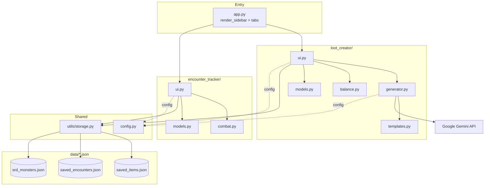
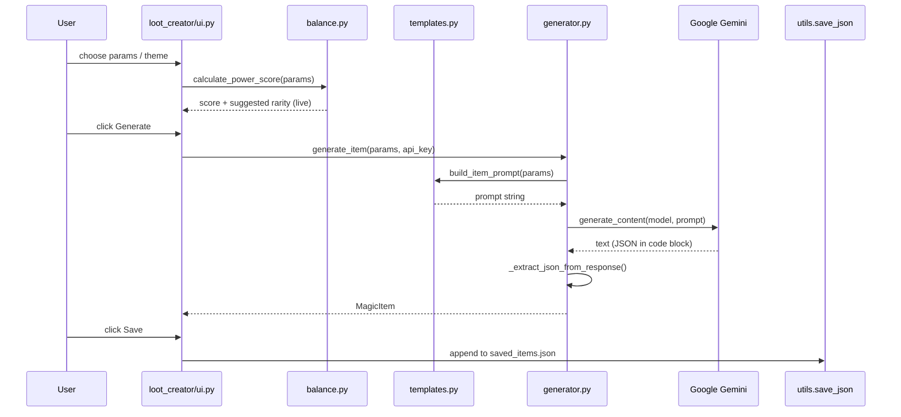
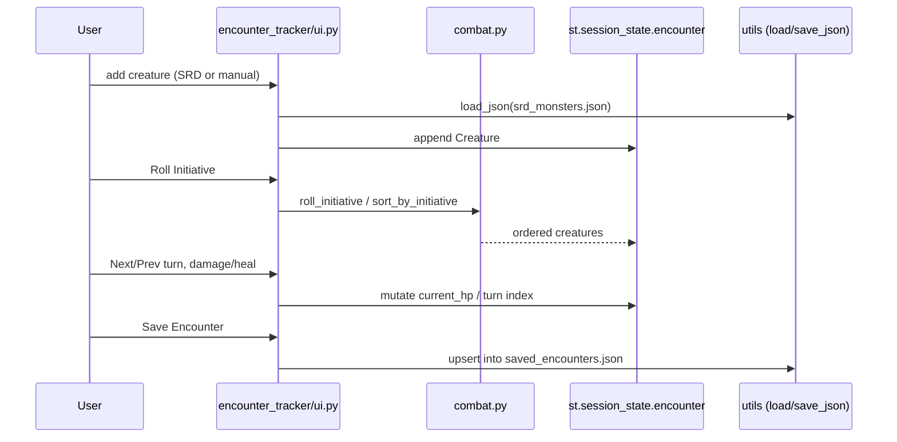

# Codebase Map

> Auto-generated by Cartographer. Last mapped: 2026-05-30T18:14:34Z

## System Overview

**DnDTools** is a **Streamlit web app** providing two D&D 5e tools in a single
tabbed page:

1. **Loot Creator** — generates balanced magic items via the Google Gemini API,
   with a quantitative power-scoring system that suggests an appropriate rarity.
2. **Encounter Tracker** — a combat/initiative tracker for running encounters.

The app is pure Python. Feature code lives in two feature packages
(`loot_creator/`, `encounter_tracker/`) plus a shared `utils/` package and a
flat `config.py`. Persistence is plain JSON files in `data/`.


```mermaid
graph TB
    subgraph Entry
        App[app.py<br/>render_sidebar + tabs]
    end
    subgraph LootCreator[loot_creator/]
        LUI[ui.py]
        LGEN[generator.py]
        LTPL[templates.py]
        LBAL[balance.py]
        LMOD[models.py]
    end
    subgraph EncounterTracker[encounter_tracker/]
        EUI[ui.py]
        ECMB[combat.py]
        EMOD[models.py]
    end
    subgraph Shared
        CFG[config.py]
        UTIL[utils/storage.py]
    end
    subgraph Data[data/*.json]
        DSRD[(srd_monsters.json)]
        DENC[(saved_encounters.json)]
        DITM[(saved_items.json)]
    end
    Gemini[Google Gemini API]

    App --> LUI
    App --> EUI
    LUI --> LGEN --> LTPL
    LGEN --> Gemini
    LUI --> LBAL
    LUI --> LMOD
    LUI --> UTIL --> DITM
    EUI --> ECMB
    EUI --> EMOD
    EUI --> UTIL
    UTIL --> DENC
    UTIL --> DSRD
    LUI -.config.-> CFG
    EUI -.config.-> CFG
    LGEN -.config.-> CFG
```

## Directory Structure

```
DnDTools/
├── app.py                     # Entry point: page config, sidebar, tabs
├── config.py                  # File paths, D&D reference lists, Gemini model name, .env load
├── requirements.txt           # streamlit, google-genai, pydantic, python-dotenv
├── loot_creator/              # Magic-item generation feature
│   ├── __init__.py            # Public API re-exports
│   ├── models.py              # Pydantic models + enums (LootParameters, MagicItem, ...)
│   ├── balance.py             # Power-score formula + rarity suggestion
│   ├── templates.py           # Builds Gemini prompts from parameters
│   ├── generator.py           # Calls Gemini API, parses JSON response
│   └── ui.py                  # Streamlit UI (quick/advanced mode, saved items)
├── encounter_tracker/         # Combat / initiative tracker feature
│   ├── __init__.py            # Public API re-exports
│   ├── models.py              # Creature, Encounter (Pydantic)
│   ├── combat.py              # Dice, initiative, HP helpers
│   └── ui.py                  # Streamlit UI (creature cards, add form, save/load)
├── utils/                     # Shared utilities
│   ├── __init__.py            # Re-exports load_json / save_json
│   └── storage.py             # JSON read/write with data-dir auto-create
├── data/                      # JSON persistence (relative to CWD)
│   ├── srd_monsters.json      # Read-only: 30 SRD monsters for the dropdown
│   ├── saved_encounters.json  # Read/write: saved encounters
│   └── saved_items.json       # Read/write: saved magic items
└── docs/
    └── CODEBASE_MAP.md        # This file
```

## Module Guide

### Entry — `app.py`

**Purpose**: Configures the Streamlit page, renders the sidebar (API key input),
and wires the two feature tabs.
**Entry point**: `main()` (run via `streamlit run app.py`).
**Exports**: `render_sidebar()`, `main()`.
**Dependencies**: `streamlit`, `loot_creator.ui.render_loot_creator`,
`encounter_tracker.ui.render_encounter_tracker`.
**Notes**: Initializes `st.session_state["user_api_key"]` with a guard. The API
key is held in session state only — never persisted, lost on refresh.

### `config.py`

**Purpose**: Central constants — file paths, D&D 5e reference lists, the Gemini
model name; loads `.env` via `python-dotenv`.
**Key exports**: `GEMINI_API_KEY`, `GEMINI_MODEL`, `DATA_DIR`,
`SAVED_ITEMS_FILE`, `SAVED_ENCOUNTERS_FILE`, `SRD_MONSTERS_FILE`,
`D5E_CONDITIONS`, `DAMAGE_TYPES`, `ABILITY_SCORES`, `CLASSES`, `ALIGNMENTS`.
**Gotcha**: All paths are **relative** — the process must run from the repo root.

### `utils/` — shared storage

**Purpose**: Thin JSON I/O layer; the only shared utility.
**Exports**: `load_json(filepath, default)`, `save_json(filepath, data)`.
**Patterns**: Defensive read (returns `default` on missing/corrupt file);
auto-creates `data/` on every write. No file locking.

### Module — `loot_creator/`

**Purpose**: Generate balanced magic items via Gemini, scored for power level.
**Entry point**: `render_loot_creator()` (`ui.py`).

| File | Purpose | Tokens |
|------|---------|--------|
| ui.py | Streamlit UI: quick/advanced mode, power-score display, saved items | 3641 |
| balance.py | Power-score formula, `RARITY_POWER_RANGES`, rarity suggestion | 2483 |
| templates.py | Builds detailed/quick Gemini prompts from parameters | 1798 |
| models.py | Pydantic models + enums (`LootParameters`, `MagicItem`, ...) | 1656 |
| generator.py | Calls Gemini API, extracts/parses JSON into `MagicItem` | 1105 |
| __init__.py | Re-exports public API | 189 |

**Key flow**: `ui.py` builds a `LootParameters` (advanced) or
`QuickLootParameters` (quick) → `balance.calculate_power_score` shows a live
score → `generator.generate_item` builds a prompt via `templates` and calls
Gemini → response parsed into a `MagicItem` → saved to `data/saved_items.json`.

**Power-score formula** (`balance.py`):
`Score = [(ΔDPR × ActionEcon × Usage) + Defense + Control] × Reliability − Constraints`.
`get_suggested_rarity` maps the score to a `Rarity` via `RARITY_POWER_RANGES`
(Common 0–2, Uncommon 2–5, Rare 5–10, Very Rare 10–18, Legendary 18–30,
Artifact 30–100).

### Module — `encounter_tracker/`

**Purpose**: Track a live combat encounter (initiative, HP, conditions, rounds).
**Entry point**: `render_encounter_tracker()` (`ui.py`).

| File | Purpose | Tokens |
|------|---------|--------|
| ui.py | Streamlit UI: creature cards, add form, HP controls, save/load | 2465 |
| models.py | `Creature`, `Encounter` Pydantic models with turn/HP logic | 652 |
| combat.py | `roll_d20`, `roll_initiative`, `sort_by_initiative`, damage/heal | 448 |
| __init__.py | Re-exports public API | 60 |

**Key flow**: The live `Encounter` lives in `st.session_state.encounter`. The add
form pulls from `data/srd_monsters.json` or manual entry. Save/Load round-trip
through `data/saved_encounters.json` (upsert by name).

## Data Flow

### Loot generation (Gemini)


```mermaid
sequenceDiagram
    participant User
    participant UI as loot_creator/ui.py
    participant Balance as balance.py
    participant Tpl as templates.py
    participant Gen as generator.py
    participant Gemini as Google Gemini
    participant Store as utils.save_json

    User->>UI: choose params / theme
    UI->>Balance: calculate_power_score(params)
    Balance-->>UI: score + suggested rarity (live)
    User->>UI: click Generate
    UI->>Gen: generate_item(params, api_key)
    Gen->>Tpl: build_item_prompt(params)
    Tpl-->>Gen: prompt string
    Gen->>Gemini: generate_content(model, prompt)
    Gemini-->>Gen: text (JSON in code block)
    Gen->>Gen: _extract_json_from_response()
    Gen-->>UI: MagicItem
    User->>UI: click Save
    UI->>Store: append to saved_items.json
```

### Encounter tracking


```mermaid
sequenceDiagram
    participant User
    participant UI as encounter_tracker/ui.py
    participant Combat as combat.py
    participant SS as st.session_state.encounter
    participant Store as utils (load/save_json)

    User->>UI: add creature (SRD or manual)
    UI->>Store: load_json(srd_monsters.json)
    UI->>SS: append Creature
    User->>UI: Roll Initiative
    UI->>Combat: roll_initiative / sort_by_initiative
    Combat-->>SS: ordered creatures
    User->>UI: Next/Prev turn, damage/heal
    UI->>SS: mutate current_hp / turn index
    User->>UI: Save Encounter
    UI->>Store: upsert into saved_encounters.json
```

## Conventions

- **Feature packages** each have `models.py`, `ui.py`, and a logic module
  (`combat.py`; or `generator.py` + `balance.py` + `templates.py`).
- **Pydantic v2** for all models: `Field(...)` validation, `.model_dump()` to
  serialize, `Model(**dict)` to reconstruct.
- **Enums** all inherit `(str, Enum)` — values are human-readable strings reused
  directly as UI labels and in prompts.
- **Session state** initialized with `if "key" not in st.session_state` guards.
- **File I/O** always via `utils.load_json` / `utils.save_json` — never direct
  `open()` in feature code.
- **UI entry points** follow the `render_*` naming convention.
- **Widget keys**: creature-indexed (`creature_{index}_*`) or mode-prefixed
  (`quick_*`).

## Gotchas

- **Relative paths everywhere.** `config.py` paths and
  `utils.storage.ensure_data_dir()`'s hardcoded `"data"` require the app to run
  from the repo root.
- **API key is ephemeral** — stored only in `st.session_state["user_api_key"]`,
  with `config.GEMINI_API_KEY` (from `.env`) as fallback in `generator.py`.
- **Gemini model name** is a single constant `GEMINI_MODEL` in `config.py`. If
  generation fails with a model error, verify the name against the google-genai
  SDK's supported models.
- **No retry logic** in `generator.py`; transient API errors surface to the UI
  as `st.error`.
- **Dead/incomplete code**: `combat.apply_damage`/`apply_healing` are unused (UI
  mutates HP inline); `get_hp_color` and card `border_color`/`bg_color` are
  computed but never applied to widgets.
- **Save is append-only** for items (no dedup); encounters upsert by name.
- **`sort_by_initiative` is non-idempotent** — a `random.random()` tiebreak
  reorders ties on each call.
- **UI/model gaps**: `PassiveBonuses.saving_throw_bonuses` and
  `AdditionalProperties.immunities` exist in the model but have no Advanced-mode
  widget.

## Navigation Guide

**To add a new SRD monster**: edit [data/srd_monsters.json](data/srd_monsters.json)
(`{name, hp, ac, initiative_modifier, cr}`); no code change needed.

**To change the AI prompt**: edit [loot_creator/templates.py](loot_creator/templates.py)
(`build_item_prompt` list-builder; `build_quick_item_prompt` f-string).

**To change balancing rules**: edit the constants and formula in
[loot_creator/balance.py](loot_creator/balance.py) (`USAGE_MULTIPLIERS`,
`RARITY_POWER_RANGES`, value/penalty constants).

**To add a new item type/subtype**: add enum values in
[loot_creator/models.py](loot_creator/models.py) and extend `SUBTYPE_MAP` in
[loot_creator/ui.py](loot_creator/ui.py).

**To change the Gemini model**: edit `GEMINI_MODEL` in
[config.py](config.py).

**To add/modify the API key flow**: `render_sidebar()` in
[app.py](app.py) (capture) and `_get_api_key()` in
[loot_creator/generator.py](loot_creator/generator.py) (consume).

**To add a D&D condition / damage type**: edit the lists in
[config.py](config.py) (`D5E_CONDITIONS`, `DAMAGE_TYPES`).

**To add a UI section**: add a `render_*` function in the relevant feature's
`ui.py` and call it from `render_loot_creator()` / `render_encounter_tracker()`.
